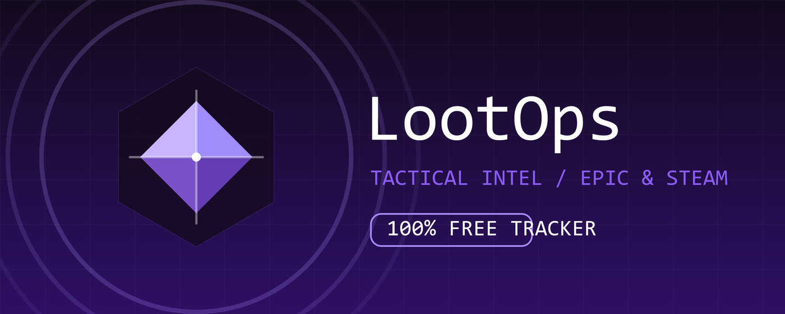

<div align="center">

# 💎 LootOps
### Tactical Game Intel for Epic & Steam

[](https://github.com/Subhan-Haider/LootOps)
[](https://github.com/Subhan-Haider/LootOps)
[](https://store.steampowered.com)
[](LICENSE)

**LootOps** (formerly LootQuest) is an advanced tactical HUD designed to stealthily intercept high-value game assets.  
We track **100% OFF** promotions on Epic Games and Steam so you never miss a supply drop.

[](#)

</div>

---

## 📡 Mission Capabilities

### ⚡ **Epic Games Interception**
Automatically secures intel on the **Weekly Free Games** and upcoming mystery drops. The HUD provides a precise countdown to the next refresh.

### 🚂 **Steam Discovery Protocol**
Scans the Steam network for hidden **"Free to Keep"** promotions. If a developer makes a paid game $0.00 for a limited time, LootOps will flag it instantly.

### 🔔 **Real-Time Supply Drops**
Receive immediate tactical alerts the second a price drops to zero.
> *"Incoming Intel: New assets secured."*

### 🖥️ **Nebula HUD Interface**
A stunning, glass-morphic dashboard that adapts to your environment:
*   🌑 **Studio Obsidian**: High-contrast dark mode for night ops.
*   ☀️ **Apple Snow**: Clean, crisp light mode for day usage.

---

## 🛠️ Field Deployment (Installation)

1.  **Clone the Repository**
    ```bash
    git clone https://github.com/Subhan-Haider/LootOps.git
    ```
2.  **Open Chrome Extensions**
    Navigate to `chrome://extensions/` in your browser.
3.  **Initialize Developer Mode**
    Toggle the switch in the top-right corner.
4.  **Load Unpacked Extension**
    Click **"Load unpacked"** and select the `LootOps` folder.
5.  **Mission Start**
    Pin the **Pulse Gem** (💎) icon to your toolbar.

---

## 🕹️ Operations Manual

| iconography | Action | Function |
| :---: | :--- | :--- |
| 💎 | **Click Icon** | Open the Tactical HUD to view active missions. |
| 🔄 | **Quick Sync** | Force an immediate intel refresh from HQ. |
| ⚙️ | **Command Sphere** | Access system settings (Theme, Notifications). |
| ⏳ | **Timer Status** | **orange** = Expiring Soon // **red** = Critical (<1h). |

---

## 📸 Surveillance (Screenshots)

<div align="center">
  
  
  
</div>

---

<div align="center">

**Source by Subhan Haider**  
*Eyes up, Operator.*

</div>
